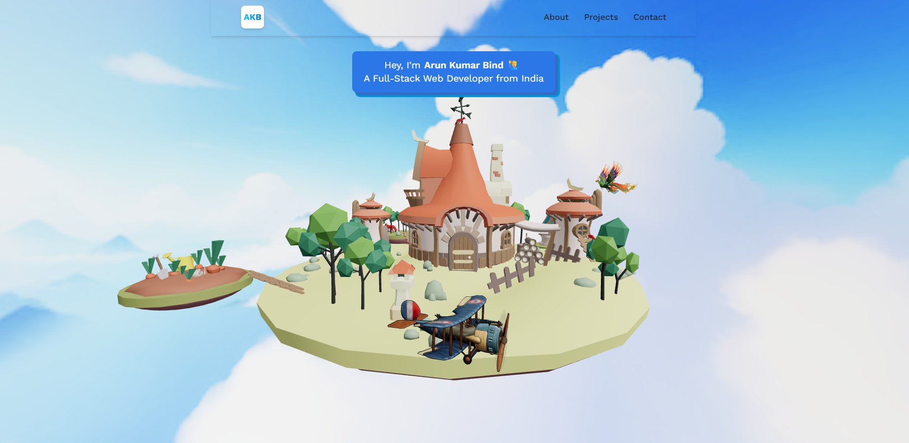
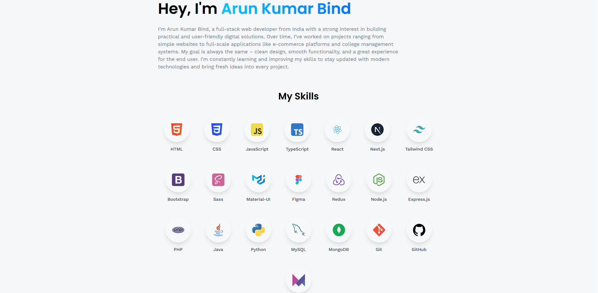

# 🚀 3D Developer Portfolio

A modern, interactive **3D Developer Portfolio Website** built with **React Three Fiber, Three.js, and Tailwind CSS**.  
Showcasing professional services like **Full-Stack Development, UI/UX Design, and 3D Web Experiences**.

)

---

## ✨ Key Features

- 🎨 **3D Web Development** – Immersive 3D experiences using **React Three Fiber** & **Three.js**  
- ⚡ **Tailwind CSS Styling** – Responsive, modern, and visually appealing UI  
- 🛠️ **Service Offerings** – Full-stack development, UI/UX design, technical consulting, and more  
- 📱 **Responsive Design** – Optimized for desktops, tablets, and mobile devices  
- 💡 **Interactive Components** – Smooth animations and 3D interactions  

---

## 📂 Getting Started

Follow these steps to run the project locally:

### 1️⃣ Clone the Repository
```bash
git clone https://github.com/ritika789/3d-portfolio.git

```
### 2️⃣ Install Dependencies
```bash
cd 3d-portfolio
npm install
```
### 3️⃣ Run the Development Server
```bash
npm start

```
- Now open http://localhost:3000
 in your browser 🚀

 ## 📸 Portfolio Screenshots

 

 

 ## 🛠️ Tech Stack

- Frontend: React.js, React Three Fiber, Three.js

- Styling: Tailwind CSS

- Deployment: GitHub Pages / Vercel / Netlify

### 📝 Credits

 - JavaScript Mastry – For inspiration and guidance in building interactive 3D web components

# 👩‍💻 Author

Made with ❤️ by **Arun Kumar Bind**

- **Email:** developerarunwork@gmail.com  
- **Phone:** +91-9129939972 
- **GitHub:** [https://github.com/abx15](https://github.com/abx15)  
- **Portfolio 1:** [https://arun-s-devspace-3d.netlify.app/](https://arun-s-devspace-3d.netlify.app/)  
- **Portfolio 2:** [https://arun15dev.netlify.app/](https://arun15dev.netlify.app/)  
- **LinkedIn:** [https://www.linkedin.com/in/arun-kumar-bind](https://www.linkedin.com/in/arun-kumar-bind)  
- **Twitter:** [https://twitter.com/arun_k_bind](https://twitter.com/arun_k_bind)
